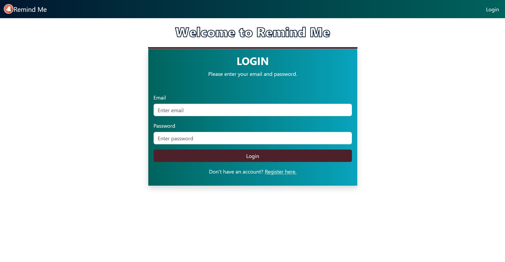
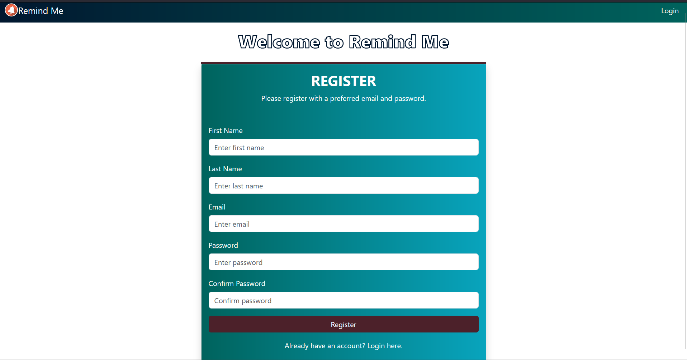
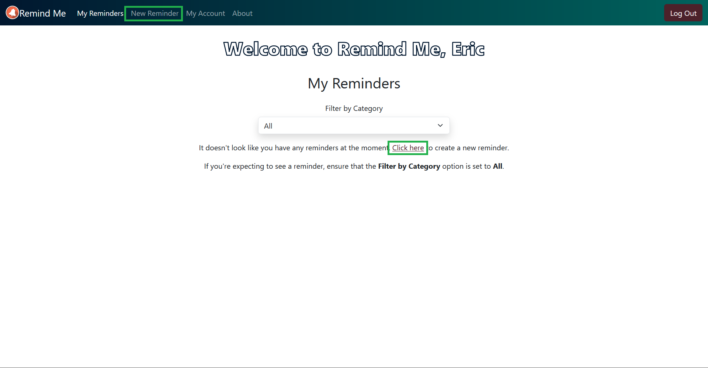
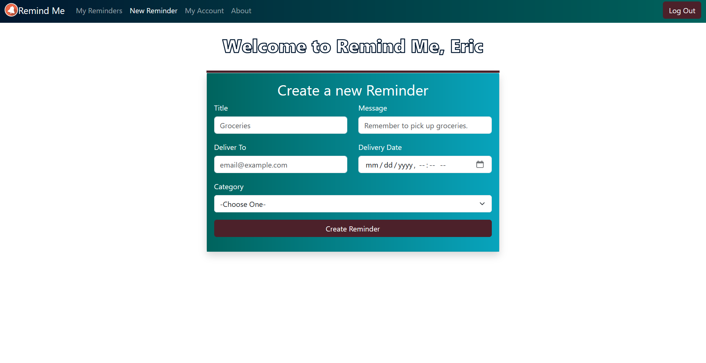
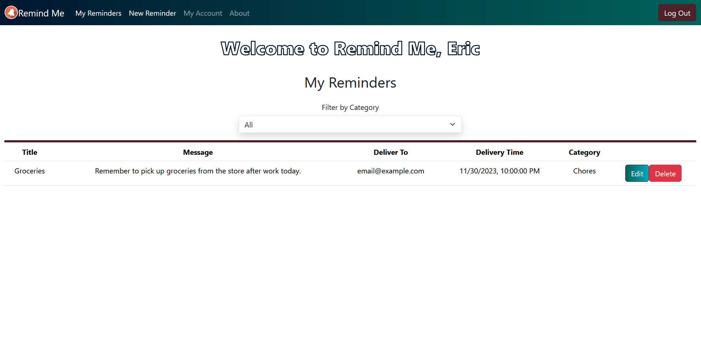

# Remind Me
## What have *you* forgotten today?

As our lives get more busy and chaotic, it becomes so much easier to forget things or have something slip through the cracks. **Remind Me** aims to address this by delivering customized email notifications at times specified by the user.

**Remind Me** is a full-stack web application built by Eric Hoffman as his first personal capstone project with DevMountain. Currently, no mobile versions are offered.

## Table of Contents
1. [Technologies and Frameworks](https://github.com/EricTheHoff/RemindMe#technologies-and-frameworks)

2. [How to Run **Remind Me** Locally](https://github.com/EricTheHoff/RemindMe#how-to-run-remind-me-locally)

3. [Using Your Own SendGrid API Key and Sender](https://github.com/EricTheHoff/RemindMe#using-your-own-sendgrid-api-key-and-sender)

4. [How to Use **Remind Me**](https://github.com/EricTheHoff/RemindMe#how-to-use-remind-me)

## Technologies and Frameworks
* JavaScript
* HTML5
* SASS / SCSS
* React
  * React Bootstrap
  * React Redux
  * React Router
* Express.js
* PostgreSQL
* Sequelize ORM
* SendGrid API
* Bcrypt
* Vite
* Axios

## How to Run **Remind Me** Locally
**Remind Me** is not a live application at the moment, so it needs to be ran locally.

After downloading the application's code from GitHub, load the files in your preferred code editor (such as *Visual Studio Code*). Run the following commands in your directory terminal:

* `npm i` or `npm install` *(Installs project dependencies)*
* `npm run initdb` and `npm run seed` *(Creates and seeds the database)*
  * Alternatively, you can also use `npm run db` *(Combines the database and seed scripts)*
* `npm run dev` *(Launches the application)*
  * Currently, the URL used for the application is http://localhost:8000

## Using Your Own SendGrid API Key and Sender
**Remind Me** utilizes SendGrid's SMTP API for email delivery. In order to use this service, you will need to create your own API key with SendGrid and save it to a **.env** variable called **REACT_APP_SENDGRID_API_KEY**. In addition to this, you will need to add a verified sender to your SendGrid account.

**To obtain your SendGrid API key:**
1. Sign up for a free account here: [SendGrid](https://sendgrid.com/en-us/solutions/email-api).
2. Once you're logged in, instructions for generating a full-access API key can be found here: [Creating an API Key](https://docs.sendgrid.com/ui/account-and-settings/api-keys#creating-an-api-key)
3. After you've created your API key, save it to a **.env** variable called **REACT_APP_SENDGRID_API_KEY**.

**To create a verified sender:**
1. Instructions for adding a verified sender in SendGrid can be found here: [Adding a Sender](https://docs.sendgrid.com/ui/sending-email/sender-verification#adding-a-sender)
2. After your sender has been verified, open the `server.js` file found at `server/server.js`.
3. Update the string value for the `email` key on lines `99` and `114`.

Please note that this app also uses a dynamic email tempalte that's local to my personal SendGrid account.

* **If you would like to use a dynamic email template:**
  * Create a dynamic email template with SendGrid. Instructions for doing so can be found here: [Design a Dynamic Template](https://docs.sendgrid.com/ui/sending-email/how-to-send-an-email-with-dynamic-templates#design-a-dynamic-template)
  * Save your template ID to a **.env** variable called **REACT_APP_SENDGRID_TEMPLATE_KEY**.
* **If you would *not* like to use a dynamic email template:**
  * Open the `server.js` file found at `server/server.js`.
  * Comment out lines `95 - 107`. Uncomment lines `110 - 118`.

## How to Use **Remind Me**
1. Log into the application with your email and password.

If you don't have an account, you can register one.

2. Once you're logged in, navigate to the *New Reminder* page to create a new reminder.

3. After you've created your reminder, it will be available on the *My Reminders* page. From here, you can edit and delete individual reminders. You can also filter your reminders by category.

4. **Remind Me** will automatically remove the reminder after the email has been delivered. If your reminder was sent but the recipient hasn't received it, make sure they check their Spam folder.

Thank you for checking out **Remind Me**!